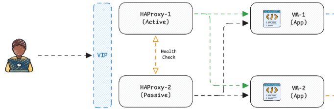

# HA PROXY
Dalam hal ini load balancer yang digunakan adalah HAProxy Community Edition. Siapkan satu buah virtual machine yang digunakan untuk menjalankan HAProxy. Pada contoh ini, sistem operasi yang digunakan adalah Ubuntu 24.04 LTS (Noble) dan berikut beberapa tahapan konfigurasinya. 


## 1. Instalasi
Lakukan ssh ke vm yang akan digunakan untuk instalasi haproxy. Lalu jalankan beberapa perintah berikut untuk melakukan instalasi
```bash
sudo apt update

sudo apt-get install --no-install-recommends software-properties-common

sudo add-apt-repository ppa:vbernat/haproxy-3.2

sudo apt-get install haproxy=3.2.\*
```
Jika proses instalasi sudah selesai, pastikan haproxy sudah terinstal dengan baik. Untuk memastikan hal tersebut silahkan gunakan perintah
```bash
sudo systemctl status haproxy.service
```

## 2. Enabled Dashboard
HAProxy memiliki fitur dashboard untuk melihat status traffic yang secara default belum aktif. Untuk dapat mengaktifkan fitur tersebut, silakan lakukan konfigurasi berikut ini. 
Langkah pertama silakan edit file **/etc/haproxy/haproxy.cfg** dan tambahkan beberapa baris berikut. 
```bash
frontend stats
        mode http
        bind :8404
        stats enable
        stats refresh 10s
        stats uri /stats
        stats show-modules
```
Jika sudah, lakukan restart service HAProxy menggunakan perintah berikut:
```bash
sudo systemctl restart haproxy.service
```
Halaman Dashboard Stats dapat diakses melalui alamat **http://<host>:8404/stats**

## 3. Load Balancer Config
Bagian ini akan menjelaskan bagaimana cara mengatur dan membagi traffic untuk diarahkan ke setiap server aplikasi. Dalam skenario ini terdapat dua backend aplikasi dan berikut cara konfigurasinya. 
Pertama, silakan edit file **/etc/haproxy/haproxy.cfg** dan tambahkan beberapa baris berikut.
```bash
frontend docapi_front
        bind :80
        default_backend docapi_backend

backend docapi_backend
        balance roundrobin
        option httpchk GET /health

        server backend-1 [ip-backend-1]:8080 check inter 5s fall 3 rise 2
        server backend-2 [ip-backend-2]:8080 check inter 5s fall 3 rise 2
```
Jika sudah, lakukan restart service HAProxy menggunakan perintah berikut
```bash
sudo systemctl restart haproxy.service
```

## 4. HA Testing
Untuk melakukan pengujian silakan coba akses aplikasi yang berjalan menggunakan IP dari Load Balancer. Buka halaman http://[ip-load-balancer]/health dan akan muncul tampilan seperti ini. 
<p align="left">
  
</p>
Pada kondisi ini, aplikasi berjalan di dua server terpisah dan dapat diakses dengan baik. Untuk melakukan pengujian coba matikan salah satu aplikasi dan perhatikan apakah aplikasi tersebut masih dapat diakses dan berfungsi dengan baik.

## 5. HA For Load Balancer
Bagian ini menjelaskan pengembangan dari implementasi HA sebelumnya dimana penerapan HA tidak hanya dilakukan pada bagian aplikasi saja. 
<p align="left">
  
</p>
Pada skenario sebelumnya implementasi HA hanya fokus ke bagian aplikasi saja dimana masalah pada Load Balancer akan mengakibatkan single point of failure atau aplikasi tidak dapat diakses sama sekali. Dan ini merupakan hal yang cukup kritis. Berikut ini beberapa tambahan konfigurasi yang perlu dilakukan agar bagian Load Balancer dapat bekerja secara HA. Beberapa hal yang perlu disiapkan untuk menambahkan konfigurasi HA pada Load Balancer. 

- Sediakan satu buah virtual machine tambahan untuk Load Balancer.
- Lakukan installasi HAProxy pada virtual machine tersebut.  
- Sediakan 1 buah Virtual IP untuk kebutuhan VRRP (Virtual Router Redundancy Protocol). (IP dari VIP harus satu segmen dengan HAProxy)

## 6. Keepalived
Keepalived adalah service di Linux yang berfungsi untuk menyediakan High Availability (HA) dengan cara mengelola Virtual IP (VIP) dan melakukan failover otomatis ketika node utama gagal. Keepalived bukan load balancer murni, tapi sering dipakai bersama load balancer (Nginx, HAProxy, Envoy).

## 7. Install Keepalived
Lakukan installasi keepalived dikedua node Load Balancer (HAProxy-1 dan HAProxy-2) dengan perintah berikut. 
```bash
sudo apt install keepalived -y
```
Langkah selanjutnya, jalankan service keepalived dan aktifkan auto-start pada saat booting menggunakan perintah berikut.
```bash
sudo systemctl enable keepalived --now
```
Untuk melihat status service keepalived, jalankan perintah berikut.
```bash
sudo systemctl status keepalived.service
```
## 8. Keepalived Configuration
Untuk melakukan konfigurasi keepalived, buatkan file /etc/keepalived/keepalived.conf di kedua node Load Balancer (HAProxy-1 dan HAProxy-2) lalu tambahkan baris konfigurasi berikut. 

Konfigurasi keepalived pada load balancer pertama (HAProxy-1).
```bash
vrrp_script chk_haproxy {
    script "pkill -0 haproxy"
    interval 2
    fall 2
    rise 1
    weight -20
}

vrrp_instance VI_1 {
    state MASTER # SESUAIKAN BAGIAN INI
    interface enp1s0 # SESUAIKAN BAGIAN INI ip a
    virtual_router_id 51
    priority 100 # SESUAIKAN BAGIAN INI
    advert_int 1

    authentication {
        auth_type PASS
        auth_pass 1111
    }

    virtual_ipaddress {
         192.168.122.10/24 # SESUAIKAN BAGIAN INI, CEK DI ip a APAKAH SEGMEN SUDAH SAMA
    }

    track_script {
        chk_haproxy
    }
}
```
Konfigurasi keepalived pada load balancer kedua (HAProxy-2) (PASSIVE).
```bash
vrrp_script chk_haproxy {
    script "pkill -0 haproxy"
    interval 2
    fall 2
    rise 1
    weight -20
}

vrrp_instance VI_1 {
    state BACKUP # SESUAIKAN BAGIAN INI
    interface enp1s0 # SESUAIKAN BAGIAN INI ip a
    virtual_router_id 51
    priority 90 # SESUAIKAN BAGIAN INI
    advert_int 1

    authentication { # HARUS SAMA CONFIGNYA DI SERVER HAPROXY-1
        auth_type PASS 
        auth_pass 1111
    }

    virtual_ipaddress {
        192.168.122.10/24 # SESUAIKAN BAGIAN INI, SAMAKAN DENGAN CONFIG DI SERVER HAPROXY-1, CEK DI ip a APAKAH SEGMEN SUDAH SAMA
    }

    track_script {
        chk_haproxy
    }
}
```
Setelah melakukan perubahan, lakukan restart service keepalive menggunakan perintah berikut. 
```bash
sudo systemctl restart keepalived.service
```
## 9. Load Balancer Config (HAProxy-2)
Sama seperti pada skenario sebelumnya, konfigurasi HAProxy yang ada dikedua node harus identik. Maka dari itu pastikan dikedua node memiliki konfigurasi yang sama. Silakan edit file **/etc/haproxy/haproxy.cfg** dan tambahkan beberapa baris berikut
```bash
frontend stats
        mode http
        bind :8404
        stats enable
        stats refresh 10s
        stats uri /stats
        stats show-modules

frontend docapi_front
        bind :80
        default_backend docapi_backend

backend docapi_backend
        balance roundrobin
        option httpchk GET /health

        server backend-1 [ip-backend-1]:8080 check inter 5s fall 3 rise 2
        server backend-2 [ip-backend-2]:8080 check inter 5s fall 3 rise 2
```
Jika sudah, lakukan restart service HAProxy menggunakan perintah berikut
```bash
sudo systemctl restart haproxy.service
```
## 10. HA Testing 2
Untuk melakukan pengujian silakan coba akses aplikasi yang berjalan menggunakan VIP (Virtual IP). Buka halaman http://[vip-address]/swagger dan seharus akan muncul tampilan aplikasi seperti pada skenario sebelumnya. 
Pada kondisi ini, aplikasi dan load balancer sudah berjalan secara redundant. Untuk melakukan pengujian coba beberapa hal berikut:

- Matikan salah satu aplikasi dan perhatikan apakah aplikasi tersebut masih dapat diakses dan berfungsi dengan baik.
- Matikan salah satu load balancer dan perhatikan apakah aplikasi tersebut masih dapat diakses dan berfungsi dengan baik.

## 11. Summary
Pada skenario ini penerapan HA dilakukan pada bagian Aplikasi dan Load Balancer. Terdapat dua buah server yang menjalankan aplikasi dimana jika ada masalah pada salah satu node, maka aplikasi tetap dapat diakses dan berfungsi dengan baik. Di sisi Load Balancer juga terdapat dua node yang bekerja secara Active/Passive sehingga jika ada masalah pada bagian Load Balancer, aplikasi dibelakangnya masih dapat diakses dengan baik. 
