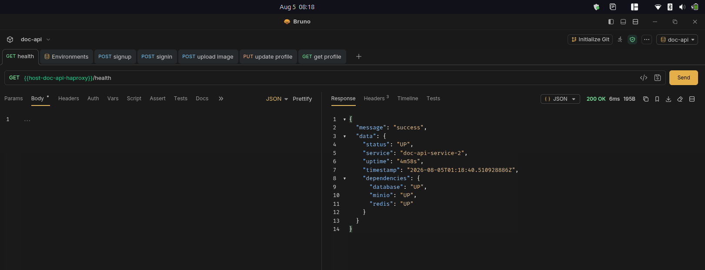

# HA PROXY
Dalam hal ini load balancer yang digunakan adalah HAProxy Community Edition. Siapkan satu buah virtual machine yang digunakan untuk menjalankan HAProxy. Pada contoh ini, sistem operasi yang digunakan adalah Ubuntu 24.04 LTS (Noble) dan berikut beberapa tahapan konfigurasinya. 


## 1. Instalasi
Lakukan ssh ke vm yang akan digunakan untuk instalasi haproxy. Lalu jalankan beberapa perintah berikut untuk melakukan instalasi
```bash
sudo apt update

sudo apt-get install --no-install-recommends software-properties-common

sudo add-apt-repository ppa:vbernat/haproxy-3.2

sudo apt-get install haproxy=3.2.\*
```
Jika proses instalasi sudah selesai, pastikan haproxy sudah terinstal dengan baik. Untuk memastikan hal tersebut silahkan gunakan perintah
```bash
sudo systemctl status haproxy.service
```

## 2. Enabled Dashboard
HAProxy memiliki fitur dashboard untuk melihat status traffic yang secara default belum aktif. Untuk dapat mengaktifkan fitur tersebut, silakan lakukan konfigurasi berikut ini. 
Langkah pertama silakan edit file **/etc/haproxy/haproxy.cfg** dan tambahkan beberapa baris berikut. 
```bash
frontend stats
        mode http
        bind :8404
        stats enable
        stats refresh 10s
        stats uri /stats
        stats show-modules
```
Jika sudah, lakukan restart service HAProxy menggunakan perintah berikut:
```bash
sudo systemctl restart haproxy.service
```
Halaman Dashboard Stats dapat diakses melalui alamat **http://<host>:8404/stats**

## 3. Load Balancer Config
Bagian ini akan menjelaskan bagaimana cara mengatur dan membagi traffic untuk diarahkan ke setiap server aplikasi. Dalam skenario ini terdapat dua backend aplikasi dan berikut cara konfigurasinya. 
Pertama, silakan edit file **/etc/haproxy/haproxy.cfg** dan tambahkan beberapa baris berikut.
```bash
frontend docapi_front
        bind :80
        default_backend docapi_backend

backend docapi_backend
        balance roundrobin
        option httpchk GET /health

        server backend-1 [ip-backend-1]:8080 check inter 5s fall 3 rise 2
        server backend-2 [ip-backend-2]:8080 check inter 5s fall 3 rise 2
```
Jika sudah, lakukan restart service HAProxy menggunakan perintah berikut
```bash
sudo systemctl restart haproxy.service
```

## 4. HA Testing
Untuk melakukan pengujian silakan coba akses aplikasi yang berjalan menggunakan IP dari Load Balancer. Buka halaman http://[ip-load-balancer]/health dan akan muncul tampilan seperti ini. 
<p align="left">
  
</p>